# Задание 1: BRIN индексы и bitmap-сканирование

1. Удалите старую базу данных, если есть:
   ```shell
   docker compose down
   ```

2. Поднимите базу данных из src/docker-compose.yml:
   ```shell
   docker compose down && docker compose up -d
   ```

3. Обновите статистику:
   ```sql
   ANALYZE t_books;
   ```

   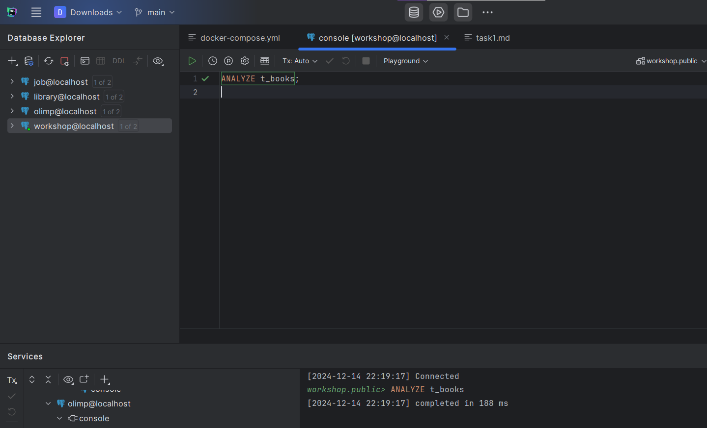

4. Создайте BRIN индекс по колонке category:
   ```sql
   CREATE INDEX t_books_brin_cat_idx ON t_books USING brin(category);
   ```
   
   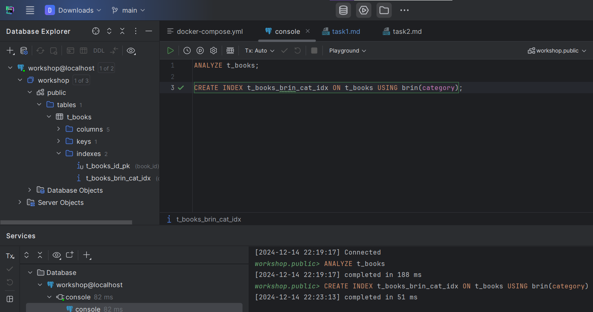

5. Найдите книги с NULL значением category:
   ```sql
   EXPLAIN ANALYZE
   SELECT * FROM t_books WHERE category IS NULL;
   ```
   
   *План выполнения:*
   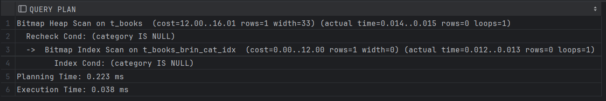
   
   *Объясните результат:*
   
   - Используется BRIN индекс при Bitmap Index Scan, чтобы быстро найти страницы, где потенциально может быть category IS NULL.

   - Используется Bitmap Heap Scan и перепроверяется условие Recheck Cond: (category IS NULL)

   - Время планирования: 0.223 ms.

   - Время выполнения: 0.038 ms.
   
   Запрос выполнился быстро с использованием BRIN-индекса.

6. Создайте BRIN индекс по автору:
   ```sql
   CREATE INDEX t_books_brin_author_idx ON t_books USING brin(author);
   ```

   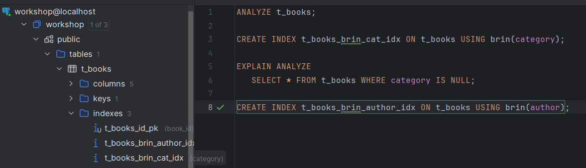

7. Выполните поиск по категории и автору:
   ```sql
   EXPLAIN ANALYZE
   SELECT * FROM t_books 
   WHERE category = 'INDEX' AND author = 'SYSTEM';
   ```
   
   *План выполнения:*
   
   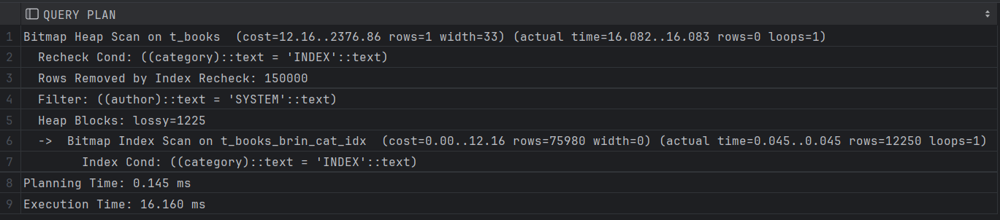
   
   *Объясните результат (обратите внимание на bitmap scan):*
   
   - Используется BRIN индекс при Bitmap Index Scan, чтобы быстро найти страницы, где потенциально может быть category = 'INDEX'.

   - На этапе Bitmap Heap Scan проверяется условие Recheck Cond: (category = 'INDEX'), а также фильтруется author = 'SYSTEM'.

   - Rows Removed by Index Recheck: 150000 — все строки отфильтрованы, так как ни одна не соответствует обоим условиям.

   - Используется "размытая" битовая карта (Heap Blocks: lossy=1225), что снижает точность обработки на этапе извлечения.

   - Время планирования: 0.145 ms.

   - Время выполнения: 16.160 ms.

   Запрос выполняется оптимально для больших таблиц, но фильтрация по author не использует индекс, что увеличивает время выполнения.

8. Получите список уникальных категорий:
   ```sql
   EXPLAIN ANALYZE
   SELECT DISTINCT category 
   FROM t_books 
   ORDER BY category;
   ```
   
   *План выполнения:*
   
   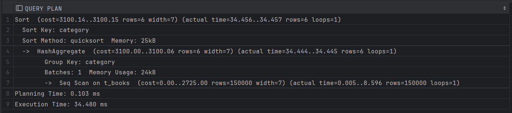
   
   *Объясните результат:*
   
   - BRIN-индекс не использовался и выполнилось Seq Scan, так как нужно было пройтись по всей таблице.

   - Создается хэш-таблица для вычисления уникальных значений в колонке category.

   - Найденные уникальные значения сортируются с использованием quicksort по category.

   - Время планирования: 0.103 ms.

   - Время выполнения: 34.480 ms.

9. Подсчитайте книги, где автор начинается на 'S':
   ```sql
   EXPLAIN ANALYZE
   SELECT COUNT(*) 
   FROM t_books 
   WHERE author LIKE 'S%';
   ```
   
   *План выполнения:*
   
   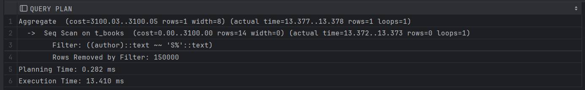
   
   Объясните результат:
   Используется Seq Scan для последовательного сканирования всей таблицы t_books, так как шаблон LIKE 'S%' не может быть ускорен с помощью существующего BRIN индекса.

   Фильтрация выполняется с использованием условия Filter: (author ~~ 'S%'), но ни одна строка не соответствует шаблону.

   Rows Removed by Filter: 150000 — все строки были отфильтрованы.

   На этапе Aggregate выполняется подсчет строк (COUNT(*)), оставшихся после фильтрации. Результат — 0.

   Время планирования: 0.282 ms.

   Время выполнения: 13.410 ms.

10. Создайте индекс для регистронезависимого поиска:
    ```sql
    CREATE INDEX t_books_lower_title_idx ON t_books(LOWER(title));
    ```
    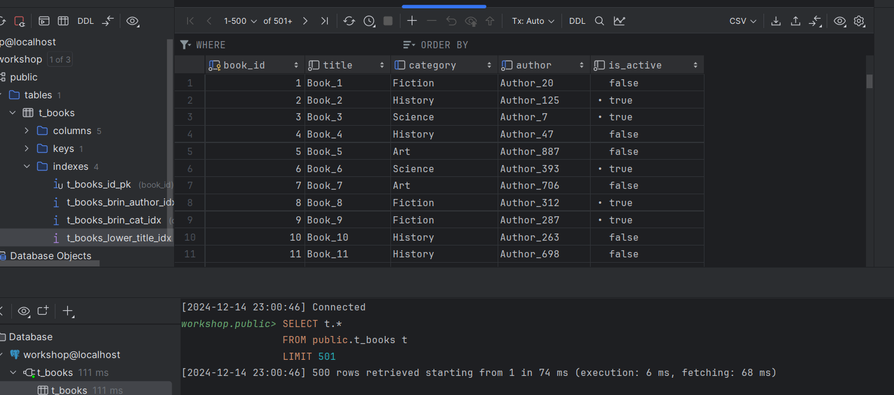

11. Подсчитайте книги, начинающиеся на 'O':
    ```sql
    EXPLAIN ANALYZE
    SELECT COUNT(*) 
    FROM t_books 
    WHERE LOWER(title) LIKE 'o%';
    ```
   
   *План выполнения:*
   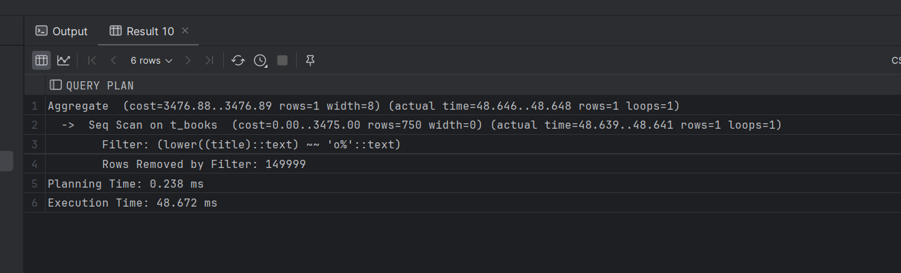
   
   *Объясните результат:*
   Индекс t_books_lower_title_idx не использовался, так как PostgreSQL решил, что выполнение Seq Scan (последовательного сканирования) будет быстрее из-за низкой селективности запроса.

   Выполнился Seq Scan, чтобы обработать все строки таблицы и применить фильтр LOWER(title) LIKE 'o%'.
   
   Фильтр LOWER(title) приводит заголовки к нижнему регистру для каждой строки и проверяет соответствие шаблону LIKE 'o%'.
   
   Rows Removed by Filter: 149999 — все строки были отфильтрованы, так как только одна строка соответствует условию.
   
   На этапе Aggregate подсчитано количество строк, оставшихся после фильтрации (COUNT(*)), результат — 1.
   
   Время планирования: 0.238 ms.
   
   Время выполнения: 48.672 ms.
   
   Индекс не использован, так как планировщик PostgreSQL посчитал, что полное сканирование будет более эффективным для данного запроса.

12. Удалите созданные индексы:
    ```sql
    DROP INDEX t_books_brin_cat_idx;
    DROP INDEX t_books_brin_author_idx;
    DROP INDEX t_books_lower_title_idx;
    ```
    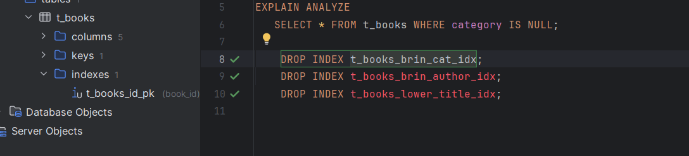

13. Создайте составной BRIN индекс:
    ```sql
    CREATE INDEX t_books_brin_cat_auth_idx ON t_books 
    USING brin(category, author);
    ```
    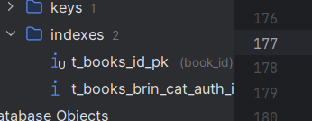

14. Повторите запрос из шага 7:
    ```sql
    EXPLAIN ANALYZE
    SELECT * FROM t_books 
    WHERE category = 'INDEX' AND author = 'SYSTEM';
    ```
   
   *План выполнения:*
   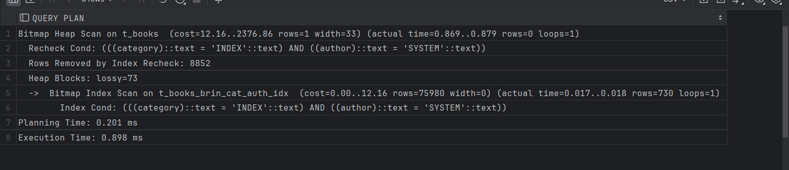
   
   *Объясните результат:*
   BRIN-индекс был использован на этапе Bitmap Index Scan, чтобы быстро найти страницы таблицы, где одновременно выполняются условия category = 'INDEX' и author = 'SYSTEM'.

   На этапе Bitmap Heap Scan происходит загрузка страниц, указанных индексом, и выполняется дополнительная проверка условий Recheck Cond.
   
   Rows Removed by Index Recheck: 8852 — из найденных страниц отфильтрованы строки, которые не соответствовали обоим условиям.
   
   Heap Blocks: lossy=73 — BRIN-индекс возвращает "размытые" битовые карты, поэтому проверяются все строки в указанных страницах.
   
   Время планирования: 0.201 ms.
   
   Время выполнения: 0.898 ms.
   
   Использование составного BRIN-индекса значительно ускорило выполнение запроса, минимизировав количество проверяемых данных.