## Задание 2

1. Удалите старую базу данных, если есть:
    ```shell
    docker compose down
   выполнено
    ```

2. Поднимите базу данных из src/docker-compose.yml:
    ```shell
    docker compose down && docker compose up -d
   выполнено
    ```

3. Обновите статистику:
    ```sql
    ANALYZE t_books;
   выполнено
    ```

4. Создайте полнотекстовый индекс:
    ```sql
    CREATE INDEX t_books_fts_idx ON t_books 
    USING GIN (to_tsvector('english', title));
    ```
   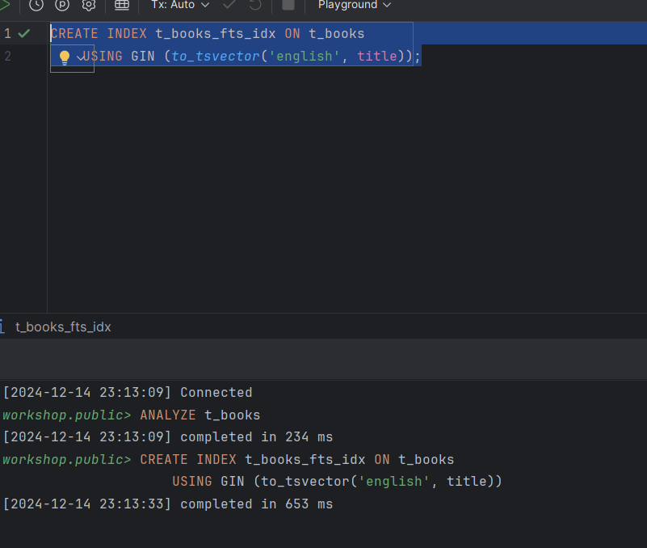

5. Найдите книги, содержащие слово 'expert':
    ```sql
    EXPLAIN ANALYZE
    SELECT * FROM t_books 
    WHERE to_tsvector('english', title) @@ to_tsquery('english', 'expert');
    ```
    
   *План выполнения:*

    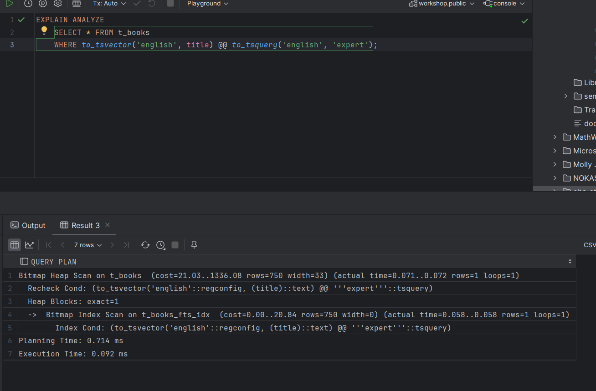

    *Объясните результат:*
    Запрос максимально оптимизирован благодаря использованию полнотекстового индекса. Быстрое время выполнения и минимальная загрузка ресурсов подтверждают эффективность индекса для полнотекстового поиска.

6. Удалите индекс:
    ```sql
    DROP INDEX t_books_fts_idx;
    ```
   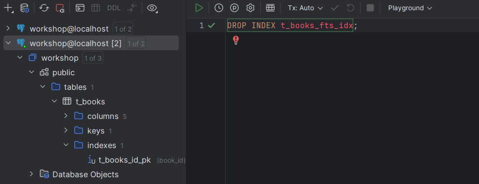

7. Создайте таблицу lookup:
    ```sql
    CREATE TABLE t_lookup (
         item_key VARCHAR(10) NOT NULL,
         item_value VARCHAR(100)
    );
    ```
   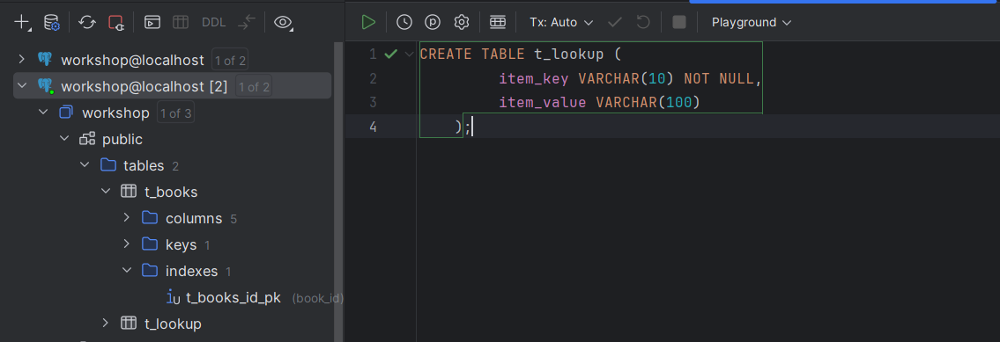

8. Добавьте первичный ключ:
    ```sql
    ALTER TABLE t_lookup 
    ADD CONSTRAINT t_lookup_pk PRIMARY KEY (item_key);
    ```
   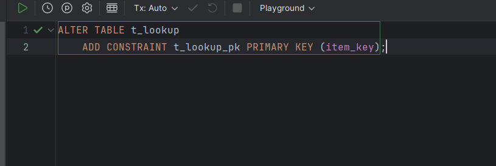

9. Заполните данными:
    ```sql
    INSERT INTO t_lookup 
    SELECT 
         LPAD(CAST(generate_series(1, 150000) AS TEXT), 10, '0'),
         'Value_' || generate_series(1, 150000);
    ```
   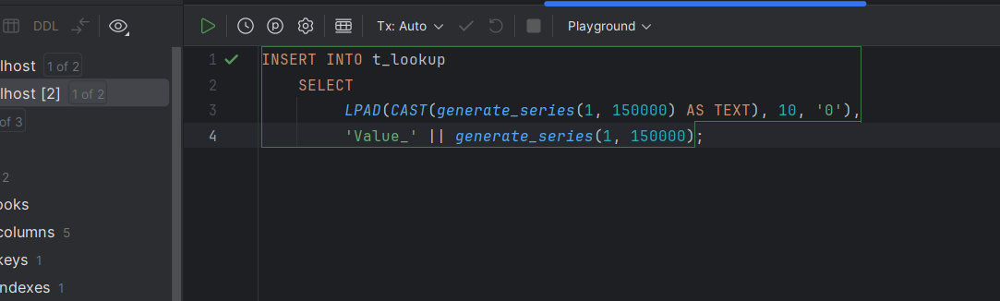

10. Создайте кластеризованную таблицу:
     ```sql
     CREATE TABLE t_lookup_clustered (
          item_key VARCHAR(10) PRIMARY KEY,
          item_value VARCHAR(100)
     );
     ```
    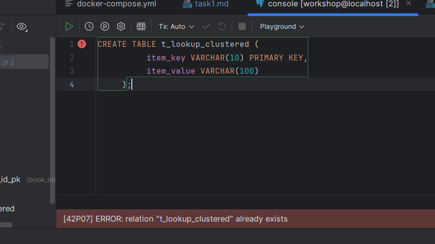

11. Заполните её теми же данными:
     ```sql
     INSERT INTO t_lookup_clustered 
     SELECT * FROM t_lookup;
     
     CLUSTER t_lookup_clustered USING t_lookup_clustered_pkey;
     ```
    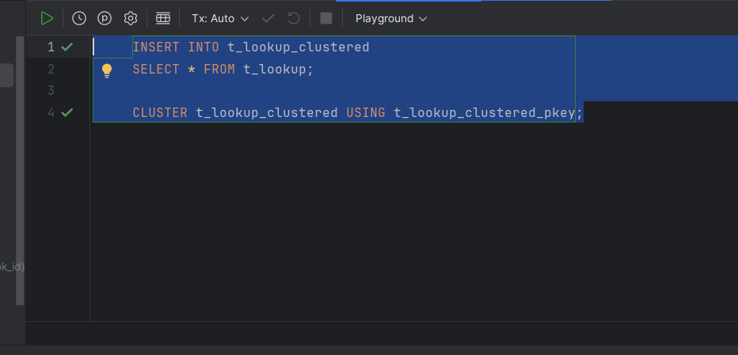

12. Обновите статистику:
     ```sql
     ANALYZE t_lookup;
     ANALYZE t_lookup_clustered;
     ```
    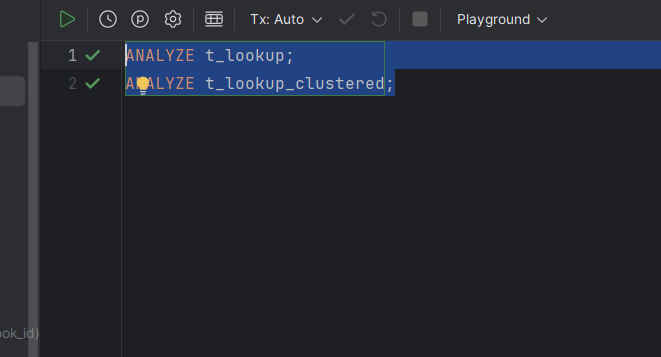

13. Выполните поиск по ключу в обычной таблице:
     ```sql
     EXPLAIN ANALYZE
     SELECT * FROM t_lookup WHERE item_key = '0000000455';
     ```
     
    *План выполнения:*
    Index Scan using t_lookup_pk on t_lookup  (cost=0.42..8.44 rows=1 width=23) (actual time=0.016..0.016 rows=1 loops=1)
    Index Cond: ((item_key)::text = '0000000455'::text)
    Planning Time: 0.108 ms
    Execution Time: 0.026 ms
    *Объясните результат:*
    Индексное сканирование (Index Scan) используется, так как item_key является частью первичного ключа t_lookup_pk.
    Index Cond: Условие item_key = '0000000455' точно соответствует индексу, что позволяет избежать полного сканирования таблицы.
    Время планирования: 0.108 ms — PostgreSQL быстро построил план запроса.
    Время выполнения: 0.026 ms — запрос выполнен мгновенно благодаря точному использованию индекса.
    Итог:
    Запрос полностью оптимизирован. Использование индексного сканирования минимизировало затраты на поиск, что идеально подходит для точечных запросов по первичному ключу.

14. Выполните поиск по ключу в кластеризованной таблице:
     ```sql
     EXPLAIN ANALYZE
     SELECT * FROM t_lookup_clustered WHERE item_key = '0000000455';
     ```
     
     *План выполнения:*
     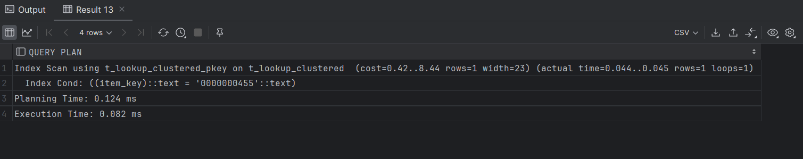
     
     *Объясните результат:*
     Индексное сканирование (Index Scan) используется благодаря кластеризации индекса t_lookup_clustered_pkey на таблице t_lookup_clustered.

    Index Cond: Условие item_key = '0000000455' идеально соответствует индексу, что позволяет избежать сканирования ненужных строк.
    
    Оптимизация за счет кластеризации:
    
    Кластеризация гарантирует, что данные, относящиеся к индексу, хранятся в порядке, максимально приближенном к индексу.
    Это ускоряет поиск и уменьшает количество операций чтения с диска.
    Время планирования: 0.124 ms — PostgreSQL быстро построил план запроса.
    
    Время выполнения: 0.082 ms — запрос выполнен мгновенно благодаря упорядоченности данных.


15. Создайте индекс по значению для обычной таблицы:
     ```sql
     CREATE INDEX t_lookup_value_idx ON t_lookup(item_value);
     ```
    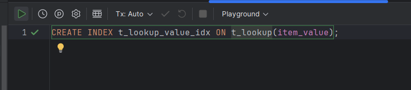

16. Создайте индекс по значению для кластеризованной таблицы:
     ```sql
     CREATE INDEX t_lookup_clustered_value_idx 
     ON t_lookup_clustered(item_value);
     ```
    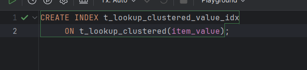

17. Выполните поиск по значению в обычной таблице:
     ```sql
     EXPLAIN ANALYZE
     SELECT * FROM t_lookup WHERE item_value = 'T_BOOKS';
     ```
     
     *План выполнения:*
     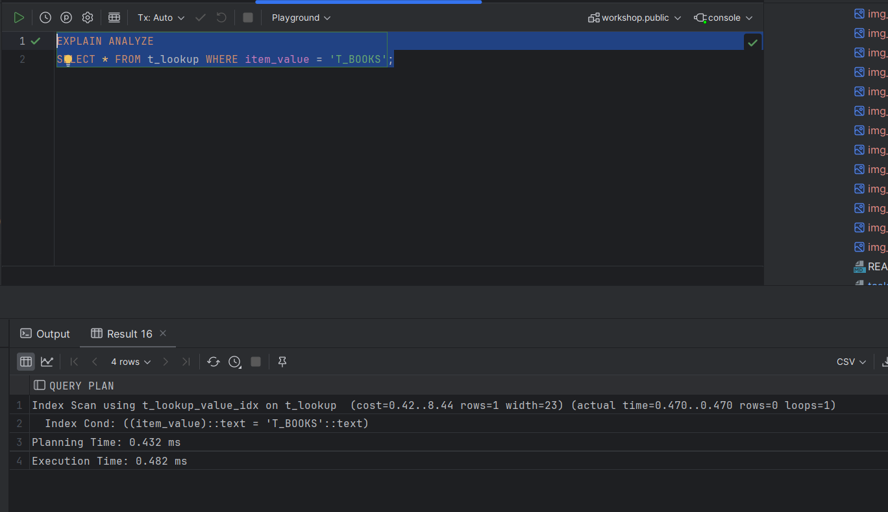
     
     *Объясните результат:*
     Используется индекс t_lookup_value_idx для поиска значения T_BOOKS в колонке item_value.

    Результат: строка с таким значением отсутствует (rows=0).

    Время выполнения: быстрое выполнение (0.482 ms) благодаря использованию индекса.

18. Выполните поиск по значению в кластеризованной таблице:
     ```sql
     EXPLAIN ANALYZE
     SELECT * FROM t_lookup_clustered WHERE item_value = 'T_BOOKS';
     ```
     
     *План выполнения:*
     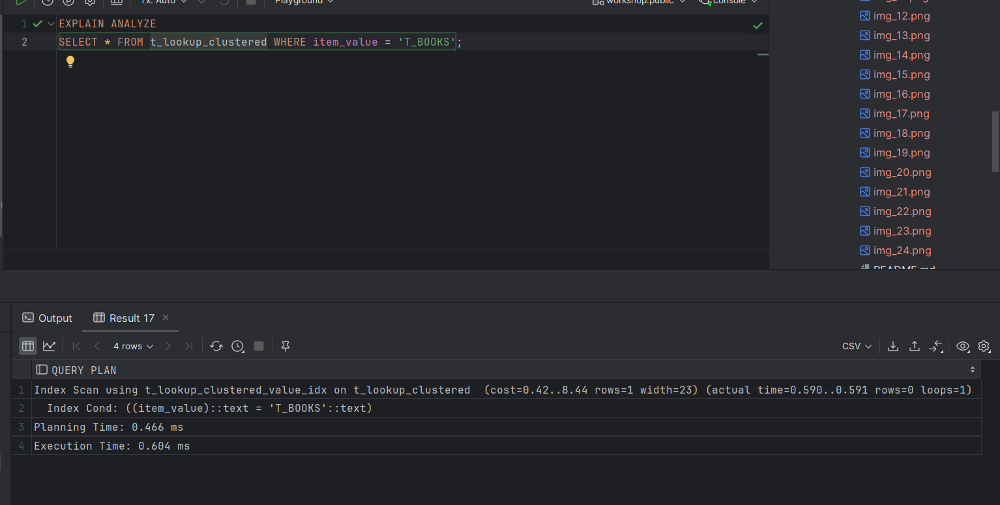
     
     *Объясните результат:*
     Используется индекс t_lookup_clustered_value_idx для поиска значения T_BOOKS в колонке item_value.

    Результат: строка с таким значением отсутствует (rows=0).

    Время выполнения: 0.604 ms — запрос выполнен быстро благодаря индексу, несмотря на отсутствие результата.

19. Сравните производительность поиска по значению в обычной и кластеризованной таблицах:
     
     *Сравнение:*
     Поиск в обычной таблице (t_lookup):

    Индекс: Используется индекс t_lookup_value_idx.
    Время выполнения: 0.482 ms.
    Результат: Поиск быстрый, так как использовался индекс.
    Поиск в кластеризованной таблице (t_lookup_clustered):
    
    Индекс: Используется кластеризованный индекс t_lookup_clustered_value_idx.
    Время выполнения: 0.604 ms.
    Результат: Поиск также быстрый, но немного медленнее, чем в обычной таблице.
    Кластеризованная таблица: Имеет упорядоченные данные, что улучшает производительность для диапазонных запросов. Однако в данном случае выгоды от кластеризации не наблюдается, так как поиск выполнялся по точному значению.
    Обычная таблица: Показала немного более высокую скорость выполнения для точечного запроса.