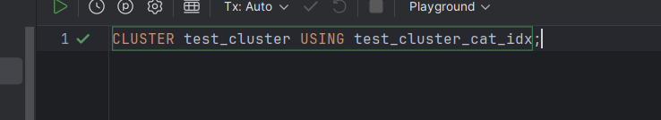

## Задание 3

1. Создайте таблицу с большим количеством данных:
    ```sql
    CREATE TABLE test_cluster AS 
    SELECT 
        generate_series(1,1000000) as id,
        CASE WHEN random() < 0.5 THEN 'A' ELSE 'B' END as category,
        md5(random()::text) as data;
    ```
   

2. Создайте индекс:
    ```sql
    CREATE INDEX test_cluster_cat_idx ON test_cluster(category);
    ```
   

3. Измерьте производительность до кластеризации:
    ```sql
    EXPLAIN ANALYZE
    SELECT * FROM test_cluster WHERE category = 'A';
    ```
    
    *План выполнения:*
    
    
    *Объясните результат:*
    Bitmap Index Scan используется для поиска строк с category = 'A' через индекс test_cluster_cat_idx.
    Bitmap Heap Scan перепроверяет найденные строки и извлекает данные из таблицы.
    Результат: найдено 499,939 строк.
    Время планирования: 0.207 ms.
    Время выполнения: 92.780 ms.
    Итог: Индекс эффективно сократил объем обрабатываемых данных, но из-за большого числа совпадений чтение заняло больше времени.

4. Выполните кластеризацию:
    ```sql
    CLUSTER test_cluster USING test_cluster_cat_idx;
    ```
    
    *Результат:*
    

5. Измерьте производительность после кластеризации:
    ```sql
    EXPLAIN ANALYZE
    SELECT * FROM test_cluster WHERE category = 'A';
    ```
    
    *План выполнения:*
    
    
    *Объясните результат:*
    Bitmap Index Scan используется для быстрого поиска строк с category = 'A' через индекс test_cluster_cat_idx.

    Bitmap Heap Scan извлекает данные из таблицы и перепроверяет условие Recheck Cond.

    Результат: найдено 499,939 строк.

    Время планирования: 0.153 ms.

    Время выполнения: 62.661 ms.

    Итог: Улучшение производительности по сравнению с предыдущим запросом за счет уменьшения количества блоков для чтения (Heap Blocks: exact=4167)

6. Сравните производительность до и после кластеризации:
    
    *Сравнение:*
    До кластеризации:

    План выполнения:
    Bitmap Index Scan для поиска строк с category = 'A' через индекс.
    Bitmap Heap Scan для извлечения данных из таблицы.
    Результат: найдено 499,939 строк.
    Heap Blocks: exact=8334.
    Время выполнения: 92.780 ms.
    После кластеризации:
    
    План выполнения:
    Bitmap Index Scan для поиска строк с category = 'A'.
    Bitmap Heap Scan после кластеризации упорядоченных данных.
    Результат: найдено 499,939 строк.
    Heap Blocks: exact=4167.
    Время выполнения: 62.661 ms.
    Итог сравнения:
    Heap Blocks: После кластеризации количество читаемых блоков уменьшилось в 2 раза (с 8334 до 4167).
    Время выполнения: Ускорение выполнения запроса на ~30% (с 92.780 ms до 62.661 ms).
    Заключение: Кластеризация упорядочила данные в таблице, уменьшив количество дисковых операций и улучшив производительность. Особенно полезна для запросов с диапазонными и выборочными условиями.